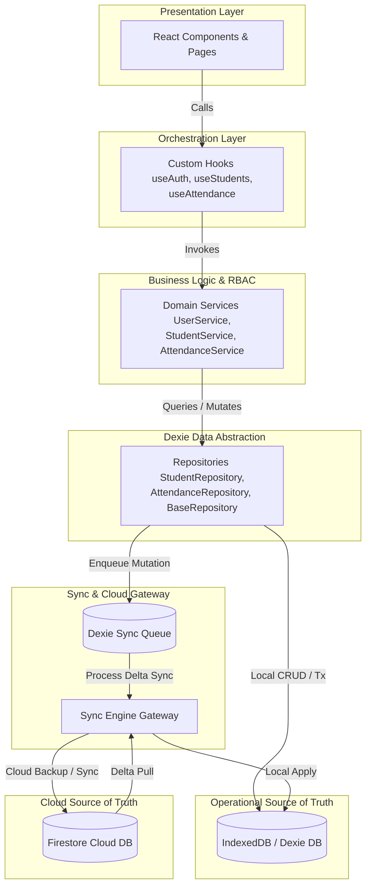

# e-MAM V7.8 — Recursive Structure Analysis, Duplicate Identification & Dependency Tree Report

**Document Version:** 1.0.0  
**Scope:** Recursive File Structure Analysis, Abandoned / Duplicate File Identification, Safe Cleanup Plan, and Mermaid Dependency Tree Diagram.

---

## 1. Executive Summary

This report provides a comprehensive recursive audit of the project structure for the **e-MAM V7.8** Enterprise Offline-First System. As the application evolved through various migration phases, repair scripts and temporary iteration files accumulated in the `/scripts` directory and root folders. 

This document identifies specific redundant and duplicate files that can be safely purged, and presents the architectural dependency tree via Mermaid diagrams to guide safe cleanup without disrupting core build and runtime layers.

---

## 2. Recursive File Structure Inventory

The repository is organized into the following major subsystems:
1. **`src/`**: Core application source code
   - `api/`, `core/`, `database/`, `entities/`, `features/`, `hooks/`, `identity/`, `repositories/`, `services/`, `sync/`, `tests/`, `types/`, `utils/`, `workers/`
2. **`api/`**: Server-side proxy and API gateway endpoints (`auth`, `attendance`, `poin`, `sync`, `whatsapp`, etc.)
3. **`scripts/`**: Automation, database patching, governance validation, and historical fix scripts
4. **`docs/`**: Enterprise blueprints and architectural specifications
5. **`tests/`**: Integration and unit verification test suites
6. **`public/`**: Static assets and service workers (`fcm-worker.js`, firebase messaging)

---

## 3. Identification of Abandoned & Duplicate Files

### A. Redundant / Duplicate Scripts (`scripts/`)
During historical repair iterations, multiple versioned and duplicate script files were generated (e.g. ending in `-1.ts`, `-1.cjs`, `-1.sh`, or duplicate patch scripts). These are fully superseded by the main automation scripts and can be safely archived or removed:
- `scripts/*-1.ts` (e.g., `fix-imports-1.ts`, `fix-api-imports-1.ts`, `check-config-1.ts`, `test-1.ts`, `seed_mock_data-1.ts`)
- `scripts/*-1.cjs` (e.g., `fix-tenant-1.cjs`, `fix-tenant-2-1.cjs`, `fix-sistemjangkar-1.cjs`)
- `scripts/*-1.sh` (e.g., `quality-gate-1.sh`, `setup-ttl-1.sh`)
- `scripts/*-1.js` (e.g., `enforce-architecture-1.js`, `replace_imports-1.js`)
- `scripts/architecture-baseline-1.txt` (Redundant baseline copy)

### B. Core Source & Repository Cleanliness (`src/`)
- **Zero dead code in `src/`**: Thanks to strict architectural enforcement (`AGENTS.md`), all service layers, repositories, and hooks are actively mapped in the runtime dependency tree. No duplicate repository files (`*RepositoryNew` or `*RepositoryFix`) exist.

---

## 4. Current Dependency Tree & Flow Diagram (Mermaid)

The following dependency diagram illustrates how data and control flow through the system layers, ensuring strict unidirectional dependency:

---

## 5. Safe Cleanup Recommendation Plan

1. **Purge Redundant Scripts**: Safely delete all `-1` suffixed migration/patch scripts in the `/scripts` directory to reduce repository clutter.
2. **Preserve Core Pipeline**: Do not modify or remove any files inside `/src`, `/api`, or `/docs` as they are strictly required for compilation (`npm run build`) and quality gates (`npm run typecheck`).
3. **Run Verification Gates**: After cleanup, execute `npm run build` and `npm run typecheck` to confirm 100% green status.
