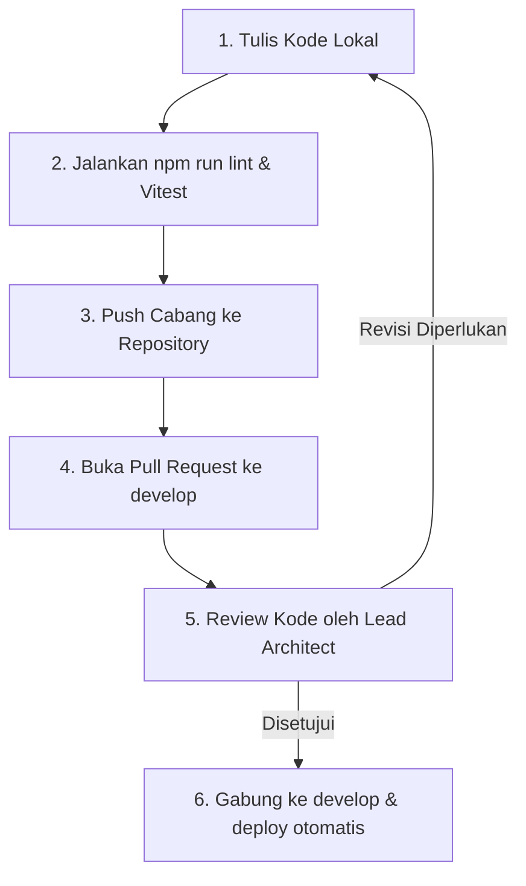

# 🤝 Pedoman Kontribusi & Standar Kode (CONTRIBUTING.md)

Kami menyambut hangat kolaborasi rekayasa untuk memperkuat operasional platform **e-Mam System**. Dokumen ini mendefinisikan regulasi teknis yang wajib dipatuhi oleh seluruh pengembang agar kode tetap rapi, aman, dan mudah dirawat.

---

## 📐 1. Standar Kode & Aturan Emas e-Mam System (Golden Rules)

Sebelum menulis baris kode baru, pastikan Anda memahami **Konvensi Sistem e-Mam System**:

1.  **Dilarang Akses Database Langsung dari UI**: Komponen UI (`/components`) hanya diperbolehkan mengonsumsi state via Custom Hooks (`/hooks`) atau Zustand Store Slices.
2.  **Karantina Operasional Async**: Seluruh fungsi pemanggilan async wajib dibungkus dengan blok `try/catch` dan memanfaatkan helper pelacak error `sanitizeError()`.
3.  **Gunakan ID Dokumen Deterministik**: Untuk entitas unik (seperti Absen harian atau Invoice bulanan), dilarang menggunakan ID acak (UUID). Wajib menggunakan gabungan relasional kunci, misalnya: `${studentId}_${date}` untuk memblokir penulisan rilis ganda.
4.  **Optimasi Dependency useEffect**: Hindari menyisipkan objek utuh atau konfigurasi array di dalam dependency array React hook `useEffect`. Hanya diperbolehkan primitive types (*string, number, boolean*).

---

## 🌿 2. Strategi Pencabangan Git (Branching Strategy)

Kami menerapkan struktur percabangan berbasis fitur yang kaku untuk mengisolasi rilis produksi dari kesalahan pengembangan:

```text
       ┌───────────┐      
       │   main    │     ◀── Produksi Stabil (Hanya Rilis Versi Resmi)
       └─────┬─────┘      
             ▼            
       ┌───────────┐      
       │  develop  │     ◀── Integrasi Fitur Baru & Tempat QA Verifikasi
       └─────┬─────┘      
             ▼            
┌────────────┴────────────┐
│ feature/absensi-haid    │  ◀── Cabang Pekerjaan Terisolasi Developer
└─────────────────────────┘
```

### Konvensi Nama Cabang (Branch Naming):
-   Pembangunan fitur baru: `feature/nama-fitur-modular`
-   Perbaikan bug darurat: `bugfix/nama-masalah-kritis`
-   Optimalisasi kode/Refactoring: `refactor/nama-modul-perbaikan`

---

## 🚀 3. Siklus Pengiriman Kode (PR & Review Workflow)

Untuk memasukkan kode baru ke dalam cabang utama, ikuti siklus validasi berikut:



### Aturan Pull Request (PR Rules):
-   Pesan commit wajib menggunakan pola **Conventional Commits**:
    -   `feat(absensi): tambah mode ibadah haid para siswi`
    -   `fix(scanner): konversi pemanggilan getDocs beku menjadi safe-helper`
-   PR wajib menyertakan deskripsi ringkas mengenai:
    1.  Penjelasan perubahan fungsional.
    2.  Dampak re-render visual.
    3.  Bukti build sukses (`npm run build`).

---

## 🛡️ 4. Pengawasan Kualitas Statis (Linting & Formatting)

Sebelum melakukan dorongan kode (*push*), jalankan pengecekan tipe statis:
```bash
npm run lint
```
Jika kode tidak lolos linting (*TypeScript Compile Errors*), server CI/CD kami akan menolak PR secara otomatis.
-   Gunakan formatter bawaan **Prettier** dengan konfigurasi standard proyek.

---
*Terima kasih telah berkontribusi menjaga efisiensi kependidikan anak bangsa bersama MAN 1 Hulu Sungai Tengah!*
