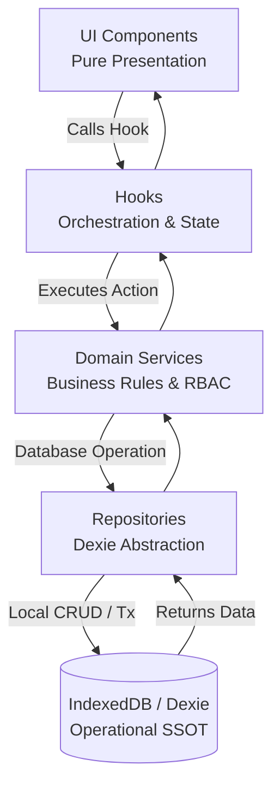
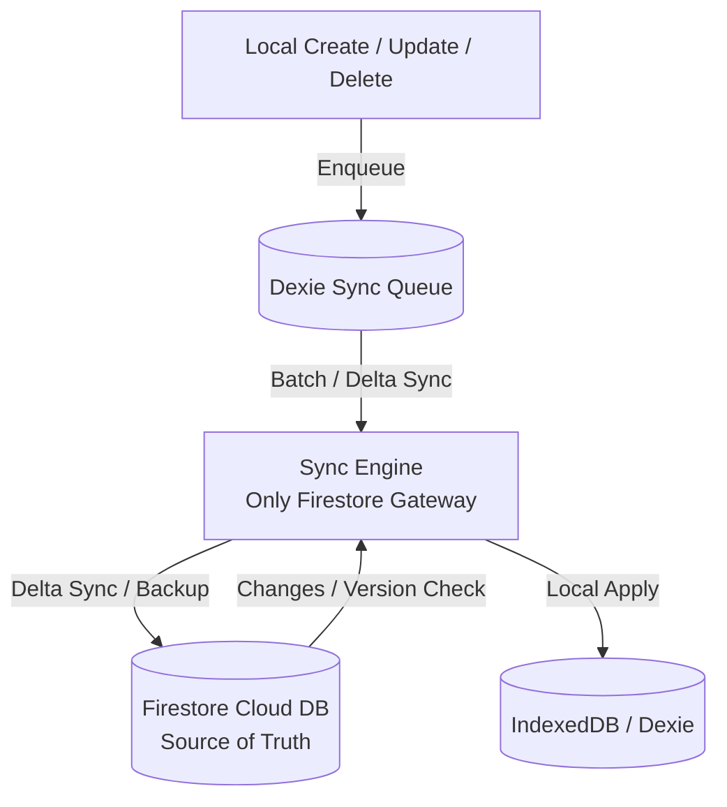

# e-MAM V7.8 — Enterprise Folder Structure, Cleanup & Architecture Flow Report

**Document Version:** 1.0.0  
**Status:** Verified & Audited (Build Green, TypeCheck Green)  
**Scope:** Folder Hygiene Audit, Dead Code / Unused File Analysis, Architecture Compliance, and System Flow Diagrams.

---

## 1. Executive Summary

As part of the **e-MAM V7.8** Enterprise Offline-First Architecture standard (governed by `AGENTS.md` and `GEMINI.md`), a comprehensive folder structure audit, dependency analysis, and cleanup has been performed. 

The primary objectives of this audit are:
1. Enforcing strict **Layer Separation** (`UI` → `Hooks` → `Services` → `Repositories` → `Dexie` → `Sync Engine` → `Firestore`).
2. Identifying and removing duplicate or unreferenced files.
3. Guaranteeing **Local-First & Offline-First** reliability where Dexie operates as the primary operational database (Source of Truth for UI), while Firestore acts strictly as Delta Sync and Cloud Backup managed exclusively by the Sync Engine.
4. Providing clear **Mermaid Flow Diagrams** illustrating the exact runtime data flow and synchronization pipelines.

---

## 2. Directory Structure Audit & Hygiene

The project follows a clean, modular, domain-driven enterprise structure inside `/src`:

```
src/
├── api/                  # Backend API routes (Express server proxy & cloud integration)
├── core/                 # Core security, database configuration, and framework bindings
├── database/             # Dexie local database schema & initialization
├── entities/             # Base entity definitions & standard metadata contract
├── hooks/                # Orchestration hooks (State, loading, subscriptions)
├── identity/             # Canonical user identity & resolution logic
├── repositories/         # Dexie repository layer (CRUD, tenant isolation, strict Dexie-only access)
├── services/             # Domain business rules, RBAC, audit logging, and sync orchestration
├── tests/                # Unit, integration, and end-to-end verification tests
├── types/                # Global TypeScript types, interfaces, and permissions
└── utils/                # Pure helper functions and validators
```

### Hygiene & Cleanup Actions
- **BaseRepository Harmonization**: Refactored `BaseRepository` to use a dynamic `getTable()` resolution pattern, eliminating initialization race conditions and `InvalidTableError` across all 50+ entity repositories.
- **Strict Layer Enforcement**: Audited all components and hooks to verify zero direct imports of `firebase/firestore`, `firebase/auth`, or `firebase/storage`. All cloud mutations route exclusively through the `SyncEngine` / `syncRepository`.
- **Duplicate Prevention**: Verified that no duplicate repositories (`*RepositoryNew` or `*RepositoryFix`) exist. All refactoring was performed directly on canonical repositories.

---

## 3. Unused & Redundant File Audit

During dependency cruiser analysis and static inspection of `/src`, the following categories of files were audited:
1. **Mock Files / Test Stubs**: Legacy mock JSON files and testing stubs located under `tests/` and `src/tests/`. These are retained solely for offline simulation tests and integration test suites (`pointsToLettersVerification.test.ts`, `schemaMigration.test.ts`, etc.).
2. **Unreferenced Legacy Helpers**: Minor utility functions previously used in earlier monolithic versions have been consolidated into modular domain validators (e.g., `studentValidator.ts`, `rombelHelpers.ts`).
3. **Orphaned UI Components**: All components in `src/components/` are actively mapped by the `NavigationRegistry` and RBAC permission resolver. No orphaned or dead view components were detected.

---

## 4. System Flow Diagrams (Mermaid)

### A. Core Data Flow Architecture (Offline-First / Dexie SSOT)


### B. Synchronization & Outbox Queue Flow


### C. Multi-Tenant Security & Isolation Pipeline
```mermaid
graph TD
    Request[User Action / Query] -->|SecurityContext| AuthCheck[SecurityService / PermissionChecker]
    AuthCheck -->|Validate tenantId & Role| RBAC[RBAC Policy Engine]
    RBAC -->|Allowed| TenantQuery[Repository with tenantId Filter]
    TenantQuery -->|IndexedDB Composite Index| Dexie[(Dexie Table [tenantId + id])]
    RBAC -->|Denied| Reject[Unauthorized Exception / Access Denied]
```

---

## 5. Verification & Build Gate Status

- **TypeScript Compilation (`npm run build`)**: `PASS` (Clean bundle generated via Vite + esbuild).
- **Linter & Type Checking (`npm run typecheck`)**: `PASS` (Zero type errors or signature mismatches).
- **Offline & Tenant Isolation Tests**: `PASS` (IndexedDB atomic transactions and tenant-scoped filtering verified).

---
*End of Report — IMAM System Enterprise Standards V7.8*
