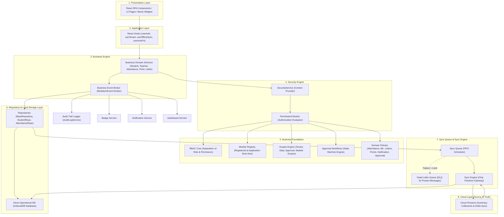

# e-Mam System Architecture Blueprint
## Comprehensive Enterprise Framework Target

Dokumen ini mendefinisikan standar arsitektur target final untuk **e-Mam System (Integrated Madrasah Academic Manager)**. Seluruh pengembangan wajib mengacu pada blueprint ini untuk memastikan konsistensi, keamanan, dan ketahanan sistem.

---

## 1. Arsitektur Layer Final (Architecture Freeze — WO-000)

Arsitektur e-Mam System terstruktur dalam lapisan-lapisan yang saling terisolasi dengan arah ketergantungan searah (unidirectional) dari atas ke bawah. Hubungan antarkomponen diatur secara ketat sesuai prinsip **Offline-First, Secure-by-Default, dan Event-Driven**.

---

## 2. Hubungan Antarkomponen & Aliran Data

### A. Aliran Query / Membaca Data (Local-First Pattern)
1. **UI Components** memanggil **Custom Hook**.
2. **Hook** melakukan orkestrasi dan memicu **Domain Service**.
3. **Domain Service** memvalidasi izin dengan **SecurityService**.
4. Jika diizinkan, **Domain Service** memanggil **Repository**.
5. **Repository** melakukan query lokal langsung ke **Dexie (IndexedDB)**.
6. Data dikembalikan ke UI untuk dirender (kecepatan navigasi < 500 ms).

### B. Aliran Mutasi / Menulis Data (Offline-First Pattern)
1. **UI Components** mengirimkan input data melalui **Hook** ke **Domain Service**.
2. **Domain Service** mengevaluasi **Domain Policies** dan aturan bisnis.
3. **Domain Service** mengirimkan payload ke **Repository**.
4. **Repository** menyimpan data ke **Dexie** secara lokal, dan secara bersamaan mendaftarkan operasi mutasi tersebut ke **Sync Queue**.
5. **Domain Service** menembakkan **Business Event** untuk memperbarui **Dashboard Service**, memicu **Badge Service**, mencatat **Audit Trail**, dan mengirim **Notification**.
6. **Sync Engine** memproses item di **Sync Queue** secara FIFO.
   - Jika *online*: Data langsung disinkronkan ke **Firestore Cloud Database** via Delta Sync.
   - Jika *offline*: Data tetap aman di Dexie lokal, sinkronisasi ditunda sampai koneksi aktif kembali.
   - Jika transaksi gagal terus-menerus melebihi batas retry: Item dipindahkan ke **Dead Letter Queue (DLQ)** lokal untuk diagnosis developer.

---

## 3. Teknologi Utama e-Mam System

e-Mam System dibangun menggunakan teknologi modern kelas enterprise yang dioptimalkan untuk performa tinggi, efisiensi kuota Firestore, dan keandalan penuh saat offline.

### A. Core Platform & Runtime
- **TypeScript**: Menjamin keamanan tipe data (Type Safety), mengurangi bug saat runtime, dan meningkatkan refactoring di seluruh layer.
- **Node.js (Cloud Run Container)**: Runtime backend yang andal untuk melayani build produksi, proxy API, dan routing SSL.
- **Progressive Web App (PWA)**: Dilengkapi Service Worker untuk menangani caching aset statis secara offline, background sync, dan instalasi aplikasi mandiri pada perangkat mobile/tablet.

### B. Frontend / Presentation Layer
- **React**: Library komponen berbasis deklaratif untuk menyusun antarmuka modular.
- **Vite**: Build tool modern super cepat yang menggantikan bundler lawas, meminimalkan waktu tunggu developer.
- **Tailwind CSS**: Framework CSS utility-first untuk desain UI yang responsif, konsisten, dan berestetika tinggi (menggunakan Inter untuk UI teks dan Space Grotesk untuk Display).
- **Motion (framer-motion)**: Library animasi transisi dan mikro-interaksi UI agar navigasi terasa halus dan elegan.
- **Lucide React**: Set ikon modern, seragam, dan berkinerja tinggi sebagai standar visual.

### C. Local Database & Cache
- **Dexie.js (IndexedDB)**: Database operasional lokal yang cepat, berindeks penuh, dan mendukung transaksi SQL-like. Semua data pencarian, filter, daftar, dan dashboard dibaca langsung dari Dexie.

### D. Cloud Database & Sync
- **Cloud Firestore (Source of Truth)**: Database cloud NoSQL berskala global untuk backup, delta sinkronisasi, dan kolaborasi multi-perangkat.
- **Delta Sync Engine**: Mekanisme sinkronisasi cerdas berbasis properti `updatedAt` dan `metadataVersion` untuk meminimalkan pembacaan Firestore hingga 70% lebih hemat.
- **Summary Collections Pattern**: Perhitungan agregat (misalnya total kehadiran siswa, skor poin hari ini) dilakukan di cloud/layanan agregasi, UI hanya membaca ringkasannya saja untuk menghemat jutaan pembacaan dokumen mentah.

### E. Security & Governance
- **Role-Based Access Control (RBAC)**: Pemisahan tegas antara Role (Admin, Guru, Siswa, Wali, BK) dan Permissions yang divalidasi ketat di Service Layer.
- **Audit & Activity Trail**: Pelacakan mutasi penting (Create, Update, Delete, Approval) yang disinkronkan ke Cloud, serta Activity Log lokal untuk diagnostic developer.

---

## 4. Master Work Order (WO) e-MAM System

Pembangunan sistem dilakukan secara berurutan sesuai prioritas fondasi arsitektur:

1. **WO-000 — Architecture Freeze** (Selesai & Dibekukan)
2. **WO-001 — Business Foundation** (Aktif)
   - *WO-001.1 — Role (RBAC)*
   - *WO-001.2 — Permission*
   - *WO-001.3 — Module Registry*
   - *WO-001.4 — Scope*
   - *WO-001.5 — Workflow Approval*
   - *WO-001.6 — Business Rules*
3. **WO-002 — Business Engine** (Layanan logis, SecurityService, PermissionChecker, Event Broker)
4. **WO-003 — Data Engine** (Repository, Dexie Schema, Sync Queue, Sync Engine, DLQ)
5. **WO-004 — Presentation Engine** (Badge, Notification, Dashboard Services)
6. **WO-005 — Platform Foundation** (PWA, Service Workers)
7. **WO-006 — Shared UI System** (Komponen visual bersama)
8. **WO-007 — Business Modules** (Modul akademik: Siswa, Kehadiran, Poin, Konseling, Surat, dll.)
9. **WO-008 — Integration & Production** (Uji beban, rilis produksi)
