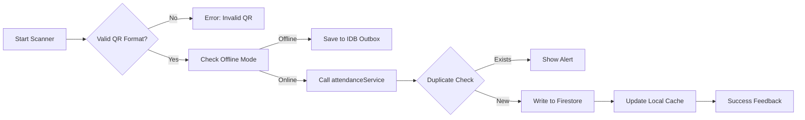
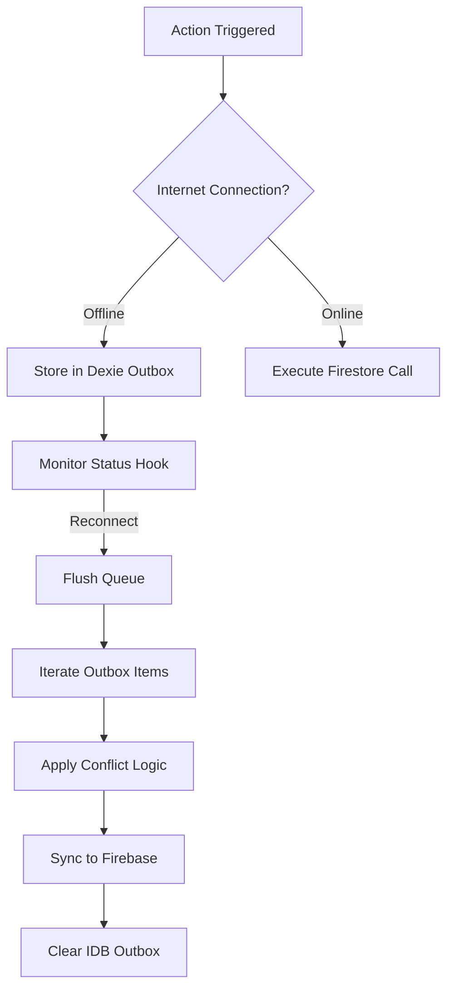
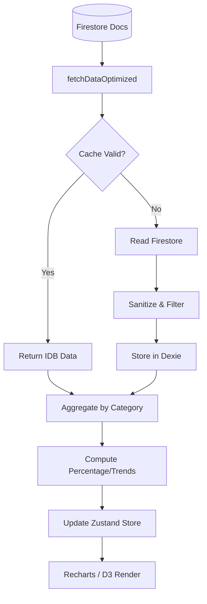
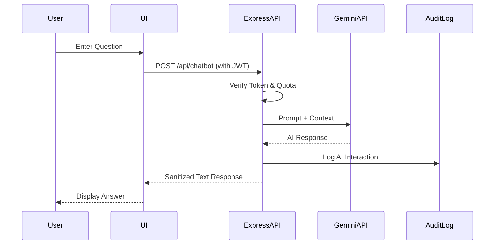
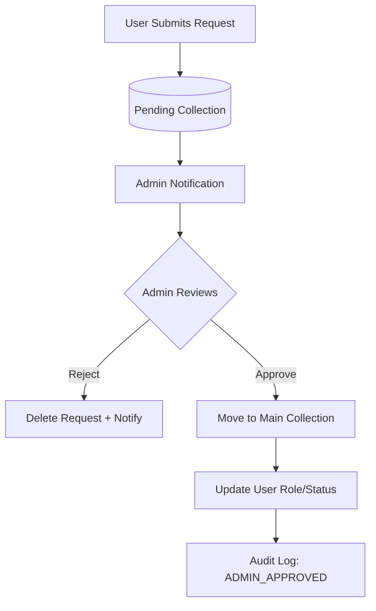
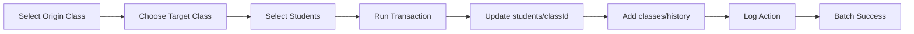
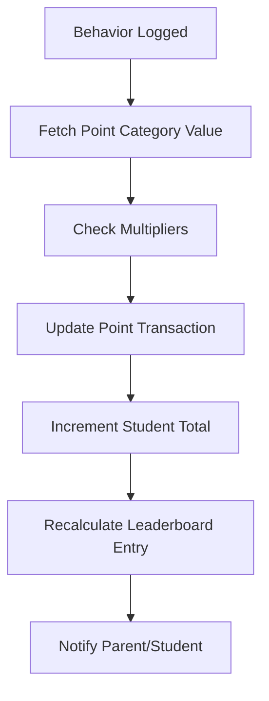
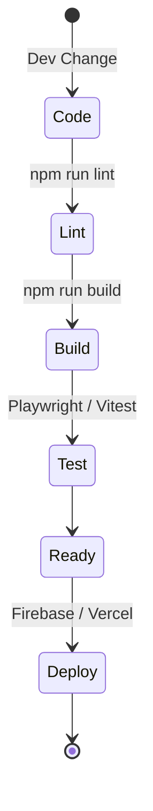

# 📊 e-Mam System - WORKFLOW DIAGRAM & PROCESS FLOW

**Version**: 6.3 (Architecture Optimized)  
**Date**: 2026-06-15  
**Author**: System Architect

---

## 1. System Architecture Diagram (Final Target Blueprint)
High-level overview of the IMAM System enterprise-grade architecture.

```mermaid
graph TD
    ROOT["src/"]
    ROOT --> APP["app/"]
    ROOT --> FEATURES["features/"]
    ROOT --> COMPONENTS["components/"]
    ROOT --> HOOKS["hooks/"]
    ROOT --> SERVICES["services/"]
    ROOT --> DATABASE["database/"]
    ROOT --> STORE["store/"]
    ROOT --> CORE["core/"]
    ROOT --> TYPES["types/"]
    ROOT --> UTILS["utils/"]
    ROOT --> ASSETS["assets/"]

%% ===========================================================
%% Layer 1
%% ===========================================================
subgraph L1["Layer 1 — Presentation"]
FEATURES
COMPONENTS
APP
end
FEATURES --> ATT["attendance/"]
FEATURES --> STUDENT["students/"]
FEATURES --> TEACHER["teachers/"]
FEATURES --> POINT["points/"]
FEATURES --> LETTER["letters/"]
FEATURES --> QR["qr/"]
FEATURES --> PTSP["ptsp/"]
FEATURES --> NEWS["news/"]
FEATURES --> CHAT["chat/"]

%% ===========================================================
%% Layer 2
%% ===========================================================
subgraph L2["Layer 2 — Hooks"]
HOOKS
HOOKS --> H1["useAuth"]
HOOKS --> H2["useTenant"]
HOOKS --> H3["useOfflineSync"]
HOOKS --> H4["useAutoFix"]
end

%% ===========================================================
%% Layer 3
%% ===========================================================
subgraph L3["Layer 3 — Business Logic"]
SERVICES
SERVICES --> DOMAIN["Domain Services"]
DOMAIN --> SS["studentService"]
DOMAIN --> TS["teacherService"]
DOMAIN --> ATS["attendanceService"]
DOMAIN --> PS["pointService"]
DOMAIN --> LS["letterService"]
SERVICES --> OFFLINE["offline/"]
OFFLINE --> BG["Background Workers"]
SERVICES --> SYNC["SyncEngine"]
end

%% ===========================================================
%% Layer 4
%% ===========================================================
subgraph L4["Layer 4 — Repository"]
DATABASE
DATABASE --> REPO["repositories/"]
REPO --> BASE["BaseRepository"]
REPO --> SR["StudentRepository"]
REPO --> TR["TeacherRepository"]
REPO --> AR["AttendanceRepository"]
REPO --> POR["PointRepository"]
REPO --> LR["LetterRepository"]
DATABASE --> DEXIE["dexie.ts"]
DATABASE --> SCHEMA["schema.ts"]
DATABASE --> MIGRATION["migrations.ts"]
end

%% ===========================================================
%% Layer 5
%% ===========================================================
subgraph L5["Layer 5 — Data Sources"]
DEXIE_DB["(IndexedDB / Dexie)"]
QUEUE["sync_queue"]
DLQ["dead_letter_queue"]
META["sync_metadata"]
FIRESTORE["(Cloud Firestore)"]
SUMMARY["Summary Collections"]
end

BASE --> DEXIE_DB
BASE --> QUEUE
QUEUE --> SYNC
SYNC --> FIRESTORE
FIRESTORE --> SYNC
SYNC --> DEXIE_DB
SYNC --> SUMMARY
DLQ --> SYNC
META --> SYNC

%% ===========================================================
%% SUPPORT
%% ===========================================================
CORE --> SECURITY["security/"]
CORE --> VALIDATOR["validators/"]
CORE --> CONSTANTS["constants/"]
CORE --> HELPERS["helpers/"]
STORE --> ZUSTAND["zustand stores"]
TYPES --> MODELS["interfaces & metadata"]
UTILS --> COMMON["shared utilities"]

%% ===========================================================
%% RULES
%% ===========================================================
REPO -. "Dexie Only" .-> DEXIE_DB
SYNC -. "Only Firestore Access" .-> FIRESTORE
HOOKS -. "Call Services Only" .-> SERVICES
FEATURES -. "No Database Access" .-> SERVICES
```



---

## 2. Alur Autentikasi (Authentication Flow)
Proses login yang aman dengan pengalihan multi-tenant.

```text
PENGGUNA
    │
    │ Memasukkan kredensial
    │ (NISN / NIP + Kata Sandi)
    ▼
Halaman Login
    │
    ▼
Layanan Autentikasi (Auth Service)
    │
    │ 1. Mengidentifikasi jenis akun
    │
    ├── NISN → Siswa
    │
    └── NIP → Guru / Staf / Administrator
    │
    ▼
Autentikasi Firebase
    │
    │ signInWithEmailAndPassword()
    │
    ▼
Firebase Authentication
    │
    │ Menghasilkan:
    │ • UID
    │ • ID Token
    │ • Refresh Token
    │
    ▼
Kernel Identitas (Identity Kernel)
    │
    │ Mengambil Firebase Custom Claims
    │
    │ Informasi yang diperoleh:
    │ • Jenis Akun (accountType)
    │ • Peran Utama (role)
    │ • Daftar Peran (roles[])
    │ • Tenant Madrasah (tenantId)
    │
    ▼
Canonical User Resolver
    │
    │ Memetakan identitas ke data domain
    │
    │ referenceId:
    │ • Guru  → teachers.id
    │ • Siswa → students.id
    │ • Staf  → staffs.id
    │ • Orang Tua → parents.id
    │
    ▼
Pengguna Kanonik (Canonical User)
    │
    ▼
Manajer Sesi (Session Manager)
    │
    │ Menyimpan:
    │ • currentUser
    │ • AuthorizationContext
    │ • SecurityContext
    │
    ▼
Penyelesai Hak Akses (Permission Resolver)
    │
    │ Evaluasi hak akses berdasarkan:
    │
    │ Jenis Akun (accountType)
    │        │
    │        ▼
    │ Peran Utama (role)
    │        │
    │        ▼
    │ Daftar Peran (roles[])
    │        │
    │        ▼
    │ Permission (Hak Akses)
    │
    ▼
Penyelesai Navigasi (Navigation Resolver)
    │
    │ Menentukan:
    │ • Sidebar
    │ • Dasbor
    │ • Fitur yang dapat diakses
    │
    ▼
Pemuat Workspace (Workspace Loader)
    │
    ▼
Dasbor sesuai hak akses pengguna
```

### Glosarium Istilah

| Inggris                 | Indonesia            |
| ----------------------- | -------------------- |
| User                    | Pengguna             |
| Login Page              | Halaman Login        |
| Auth Service            | Layanan Autentikasi  |
| Firebase Authentication | Autentikasi Firebase |
| Identity Kernel         | Kernel Identitas     |
| Canonical User          | Pengguna Kanonik     |
| Session Manager         | Manajer Sesi         |
| Permission Resolver     | Penyelesai Hak Akses |
| Navigation Resolver     | Penyelesai Navigasi  |
| Workspace Loader        | Pemuat Workspace     |
| Dashboard               | Dasbor               |
| Feature Access          | Akses Fitur          |
| Role                    | Peran                |
| Permission              | Hak Akses            |
| Tenant                  | Tenant Madrasah      |
| Reference ID            | ID Referensi         |

---

## 3. Attendance Scanning Workflow
Process flow from QR scan to record verification.



---

## 4. Offline Sync Engine
Ensuring data persistence during connectivity interruptions.



---

## 5. Dashboard Data Pipeline
The journey of raw Firestore data to visual charts.



---

## 6. AI Chatbot Interaction Flow
Secure handling of Gemini AI prompts.



---

## 7. Admin & Approval Workflow
Governance for account requests and data changes.



---

## 8. Class Promotion Process
Bulk migration of student academic states.



---

## 9. Points Calculation Engine
Real-time behavioral point tracking.



---

## 10. Development Lifecycle
Standard build and deployment process.



---

## 👤 Author & Contact
Documentation provided by **e-Mam System Architecture Team**.  
For deeper technical specs, refer to [AGENTS.md](AGENTS.md) and [SECURITY.md](SECURITY.md).
